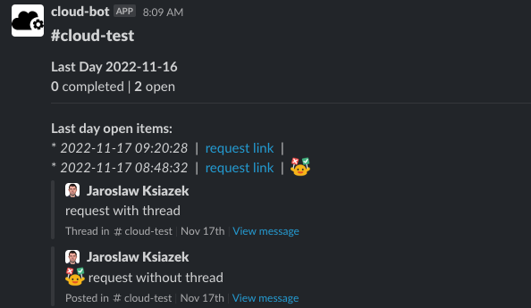
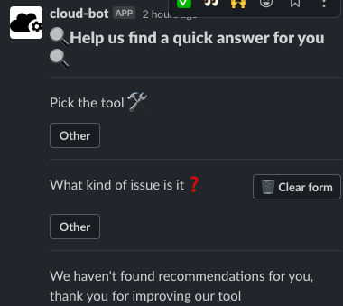

# slack011y-bus 
A tool can connect to public Slack channels for storing messages with threads and interacts with specific slack actions eg:
  * can reply for main or thread a message 
  * can create and print basic statistics 
  * can pop up a custom form where you can a specific question for a requestor
  * etc.
If you use Slack channel as support channel this tool should perfectly fit for you.

Features:
- Monitoring Slack channel - e.g. you can control your slack support channel
- Framework intercepts Slack messages, labels and stores messages
- Allows granular monitoring types of requests
- Results can be presented using Grafana framework(some examples attached) 

### Installation:
* Create db (currently the tool supports only MySql)
  * local db for testing 
    ```bash
    docker run --name slack011y-bus-db -d \                                                                                                                                                                
    -p 3306:3306 \
    -e MYSQL_ROOT_PASSWORD=change-me \
    -v slack011y-bus:/var/lib/docker/volumes/volumename/_data mysql:8 
    ```
    ```bash
    docker exec -it <docker-id> sh -c "mysql --user=root --password=change-me"
    ```
  * create database and slack user
     ```mysql
     CREATE DATABASE slacky_bus;
     CREATE USER 'slacky_bus_user'@'%' IDENTIFIED BY 'slacky_bus_user';
     GRANT ALL PRIVILEGES ON slacky_bus.* TO 'slacky_bus_user'@'%';
     ```
  * run the script slack-bus/db.sql
  * send the db details to environments
    ```bash
      export DB_USER=
      export DB_PASSWD=
      export DB_HOST=
      export DB_DB=
      export DB_PORT=
      ```
* Setup Slack to allow collecting data
  * Go to https://api.slack.com/apps/<your-workspace>
  * Create a "new webapp" - https://api.slack.com/authentication/basics#creating
    * Create an app **"from scratch"**
    * Add "App Name" and pick the **"workspace from the list"**
  * Go to https://api.slack.com/apps/<your-workspace>/oauth? and export following items:
    * Add "Scopes/Bot Token Scopes"
      * https://api.slack.com/scopes/channels:history
      * https://api.slack.com/scopes/chat:write
      * https://api.slack.com/scopes/reactions:read
      * https://api.slack.com/scopes/reactions:write
      * https://api.slack.com/scopes/users:read
      * https://api.slack.com/scopes/users:read.email
    * Click "install to workspace" on first widget 
    * export SLACK_TOKEN <- "Bot User OAuth Token"
      * 
        ```bash
        export SLACK_TOKEN=xoxb-..
        export SLACK_WORKSPACE_NAME=
          ```
    * export SIGNING_SECRET < "Signing Secret" from https://api.slack.com/apps/<your-workspace>/general?
      *
        ```bash
        export SIGNING_SECRET=xxx
          ```
  * Go to https://api.slack.com/apps/<your-workspace>/event-subscriptions?
    * Switch a toggle to "on"
    * Add url which will be used for intercepting messages (use [ngrok](https://ngrok.com/) for local testing)
      * keep the "/slack/events" as url suffix
      * e.g. "https://2137-18-134-225-225.ngrok.io/slack/events"
    * Go to "Subscribe to bot events" tab
      * Add Bot User Event
      * Slack-Bus app requires following permissions
        * https://api.slack.com/events/message.channels
        * https://api.slack.com/events/reaction_added
        * https://api.slack.com/events/reaction_removed
    * Go to https://api.slack.com/apps/<your-workspace>/interactive-messages?
      * Add url which will be used for intercepting messages (use [ngrok](https://ngrok.com/) for local testing)
        * keep the "slack/interactive-endpoints" as url suffix
        * e.g. "https://2137-18-134-225-225.ngrok.io/slack/interactive-endpoints"
  * Add apps to your Slack workspace
    * https://slack.com/intl/en-gb/help/articles/202035138-Add-apps-to-your-Slack-workspace
  * Add slack011y-bus to channel
    * https://www.ibm.com/docs/en/z-chatops/1.1.0?topic=slack-adding-your-bot-user-your-channel

### Configuration:
  * The configuration can be handled by 
    * api 
    * swagger - http://<slack011y-bus-url>/admin/api/v1/swagger/
  * Add a channel to the slack-bus app
    * use swagger "channels" to see more options 
    * 
      ```bash
      curl -X 'POST' \
      'http://<slack011y-bus-url>/admin/api/v1/channels/' \
      -H 'accept: application/json' \
      -H 'Content-Type: application/json' \
      -d '{
      "channel_id": "BOGUS_CHANNEL_ID",
      "channel_name": "slack011y-bus-test"
      }'
      ```
### Features
#### - Labelling messages using emojis
  * track messages with emojis (swagger can help with this as well) - set action for specific emoji(request type)
    * swagger - http://<slack011y-bus-url>/admin/api/v1/swagger/ - "types" to see more options
    *
      ```bash
      curl -X 'POST' \
      'http://<slack011y-bus-url>/admin/api/v1/channels/' \
      -H 'accept: application/json' \
      -H 'Content-Type: application/json' \
      -d '{
      "types": {
        "not_selected_response": "You haven't selected a type for your message.",
        "emojis": {
          "additionalProp1": {
            "emoji": "U+1F198",
            "alias": "sos",
            "image": "cloud-pr.png",
            "color": "#619BFF",
            "meaning": "Need help"
        }
      }
      ```
#### - Daily report 
 *  
 * Shows unclosed requests

#### - Question form 
* 
* adding custom question form for getting some more details about asking issue
* recommendations - based on questions form answers we can prepare common recommendations for requestors
   * swagger - http://<slack011y-bus-url>/admin/api/v1/swagger/ - "types" to see more options
#### - Start reactions
* a custom emoji reaction which we can add to main message - it triggers changing reqeust status from "initial" to "working"
  * swagger - http://<slack011y-bus-url>/admin/api/v1/swagger/ - "start_reactions" to see more options
#### - Completion reactions
* a custom emoji reaction which we can add to main message - it triggers changing reqeust status from "working" to "completed"
  * swagger - http://<slack011y-bus-url>/admin/api/v1/swagger/ - "completion_reactions" to see more options
#### - Close idle request 
* crom job which change status to "closed" for unclosed idle messages - if there is no any thread reaction for the request in defined period of time, the user will be informed and the message will be closed
